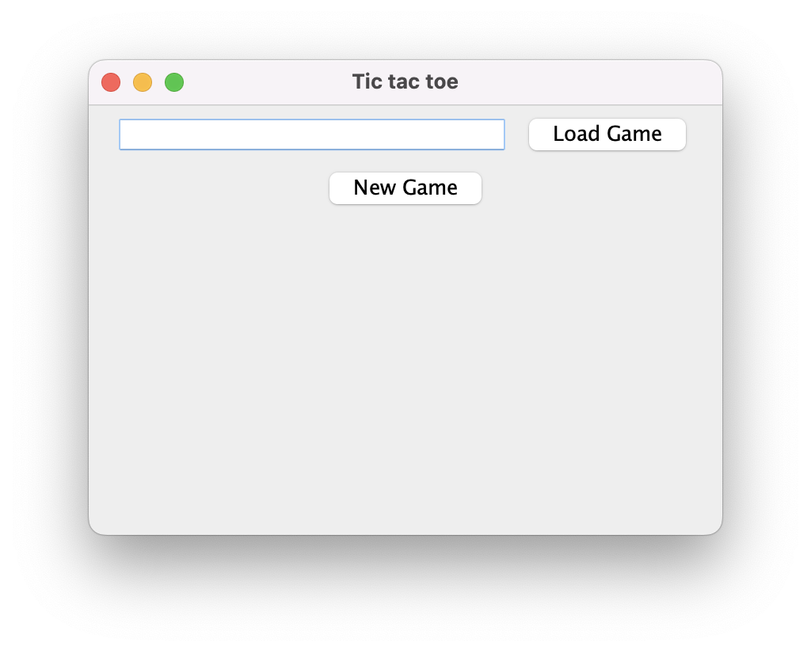
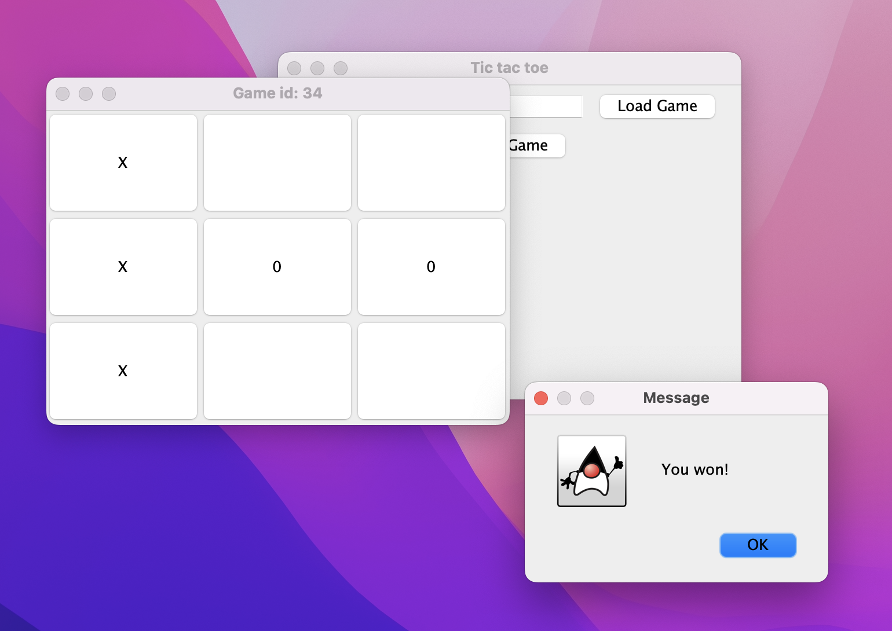

# tic-tac-toe-maven
 
Frontend for [PHP backend](https://github.com/matyash12/tic-tac-toe-game)
It run's on Java and it's my first project in Java. 

For package managment i used maven.

Here are some screenshots.

